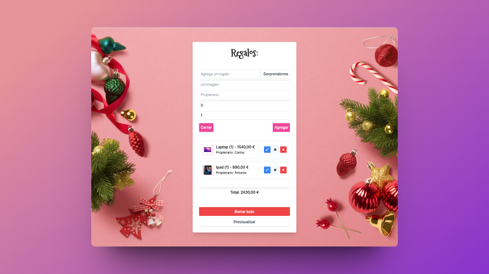

# Adviency 2023

Resolución del reto de adviento propuesto por [@goncy](https://github.com/goncy) para la comunidad.

## ⭐ ¿Que tiene de especial este repositorio?

Ademas de solucionar el reto, lo he **solucionado con varios frameworks** para poder comparar sus diferencias. ¿Con que frameworks esta resuelto?:

+  Vue 3 con Typescript. [Demo](https://wonderful-pika-287baa.netlify.app/)
+  Nextjs 13 con Typescript. [Demo](https://superlative-cocada-09b658.netlify.app/)
+  Sveltekit con Typescript. [Demo](https://astonishing-pegasus-e94291.netlify.app/)
+ Deno Fresh.
+  Solidjs con Typescript. [Demo](https://comfy-sundae-fd21c9.netlify.app/)
+  Angular [Demo](https://precious-tapioca-2dc498.netlify.app/)

Aparte de lo anterior, he añadido tests E2E para probar que con todos los frameworks la solución tiene la mismas funcionalidades. Para realizar los test E2E he utilizado **Playwright**.

Y por supuesto para estilar lo he utilizado **Tailwindcss**.
